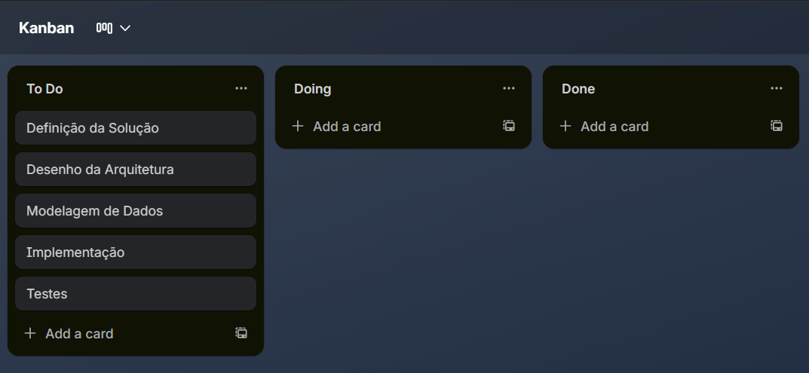
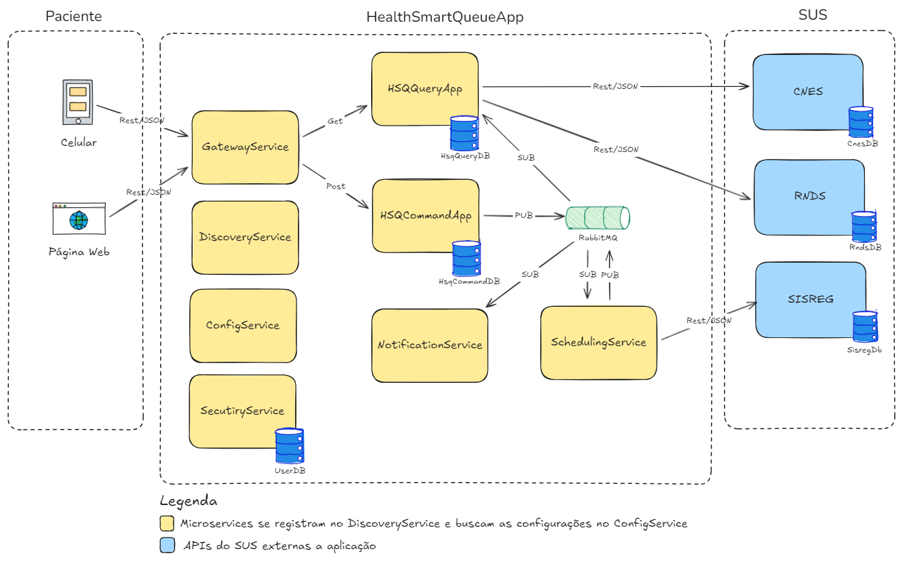

# Hackaton :: Sistema de Agendamento de Consultas com Otimização por Teoria das Filas

## 1. Introdução

O projeto apresenta o desenvolvimento de um sistema *back-end* para o agendamento inteligente de consultas e exames no SUS, fundamentado na **Teoria das Filas** para otimizar a alocação de pacientes em hospitais próximos à sua localização.

O objetivo central é a redução do tempo de espera e das filas presenciais por meio de uma distribuição eficiente de recursos. A solução integra localização para identificar unidades de saúde próximas e aplica modelos matemáticos (como **M/M/1**) para prever e sugerir unidades com menor sobrecarga. O impacto projetado inclui uma **diminuição de até 30% no tempo médio de espera**, promovendo maior satisfação dos usuários e alívio operacional para os profissionais de saúde.

## 2. Problema Identificado

O Sistema Único de Saúde (SUS) enfrenta desafios estruturais, como a sobrecarga das unidades e a ineficiência na distribuição geográfica de pacientes.

* **Dados:** Segundo o Ministério da Saúde (2023), o tempo de espera para exames especializados pode chegar a 90 dias em certas regiões.
* **Cenário Local:** Em áreas urbanas como Osasco (SP), unidades centrais sofrem com superlotação enquanto postos periféricos permanecem subutilizados.
* **Impacto:** A resolução deste problema alinha-se ao **ODS 3 da ONU (Saúde e Bem-Estar)**, visando a equidade no acesso e a modernização da gestão pública.

## 3. Descrição da Solução

A solução **Health Smart Queue (HSQ)** é um ecossistema *back-end* que viabiliza o agendamento inteligente. A partir do CEP e da especialidade, o sistema consulta a base do CNES, filtra unidades próximas e aplica cálculos de ocupação dinâmica.

### 3.1 Fundamentação Matemática

Utiliza o modelo **M/M/1** (chegadas e atendimentos de Poisson) para calcular métricas críticas, como o tempo médio na fila:


**Onde:** 
* 𝝺 = taxa de chegada.
* 𝞵 = taxa de serviço.

O sistema utiliza o cálculo do tempo médio na fila (Wq) para determinar qual hospital é a melhor escolha para o paciente no momento da consulta:
* 𝝺 (Taxa de Chegada): Representa quantos pacientes estão chegando à unidade de saúde. No HSQ, esses dados são obtidos dinamicamente.
* 𝞵 (Taxa de Serviço): Representa a capacidade de atendimento da unidade (ex: quantos pacientes um médico atende por hora). O HSQ extrai essas médias de atendimento em tempo real através da base do RNDS.


O Modelo M/M/1 é uma representação matemática de uma fila onde:
* M (Chegadas): As chegadas de pacientes ocorrem de forma aleatória, seguindo uma distribuição de Poisson.
* M (Serviço): O tempo de atendimento médico também é variável e segue uma distribuição exponencial.
* 1 (Servidor): Representa um recurso específico, como um consultório ou um médico especialista em uma unidade


### Resumo das fórmulas mais usadas

| Métrica | Fórmula principal | Fórmula alternativa |
| --- | --- | --- |
| Utilização | $\rho = \lambda / \mu$ |  |
|  (sistema vazio) |$1 - \rho$  |  |
|  ( clientes) | $(1 - \rho) \rho^n$ |  |
|  (clientes no sistema) | $\rho / (1 - \rho)$ | $\lambda / (\mu - \lambda)$ |
|  (clientes na fila) | $\rho^2 / (1 - \rho)$ | $\lambda^2 / (\mu(\mu - \lambda))$ |
|  (tempo no sistema) | $1 / (\mu - \lambda)$ | $1/\mu / (1 - \rho)$ |
|  (tempo na fila) | $\rho / (\mu - \lambda)$ | $\rho / \mu / (1 - \rho)$ |

### 3.2 Diferencial Estratégico

Diferente de sistemas tradicionais como o SISREG, o HSQ utiliza dados da RNDS para obter médias de atendimento em tempo real, permitindo uma gestão dinâmica que considera a carga atual de cada unidade.

## 4. Processo de Desenvolvimento

O desenvolvimento seguiu uma abordagem ágil com foco em **Design Thinking**:

1. **Imersão:** Criação de personas (pacientes e médicos) e mapas de empatia.
2. **Ideação:** Realização de entrevistas com profissionais da saúde para selecionar a solução de maior impacto e viabilidade técnica..
3. **Execução:** Criação do MVP1 com de *sprints* de três semanas utilizando a método ágil com suporte do Trello, conforme figura abaixo:



## 5. Arquitetura do Sistema

* **Arquitetura:** Implementação do padrão **CQRS** (*Command Query Responsibility Segregation*) e arquitetura orientada a eventos.
* **Tecnologias:** Java 21, Spring Boot, Spring Cloud, Spring Data JPA, PostgreSQL e RabbitMQ.

### 5.1 Desenho da Arquitetura



#### 5.1.1 Serviços de Negócio

* **GatewayService**: Atua como o ponto de entrada único para todas as requisições provenientes dos clientes (Celular e Página Web). Ele é responsável pelo roteamento inteligente de chamadas, protegendo a arquitetura interna. Ele diferencia as intenções do usuário: direciona operações de leitura (GET) para o serviço de consulta e operações de escrita (POST) para o serviço de comando, além de realizar a primeira camada de integração com o SecurityService para validação de tráfego.
* **HSQQueryApp**: Implementa o lado de Leitura (Query) do padrão CQRS. Este serviço é otimizado para alta performance em consultas de dados, possuindo seu próprio banco de dados (HsqQueryDB). Ele consome mensagens do RabbitMQ para manter sua base sincronizada e busca informações em tempo real nos serviços do SUS (CNES e RNDS) para fornecer uma visão consolidada e atualizada ao paciente
* **HSQCommandApp**: Implementa o lado de Escrita (Command) do padrão CQRS. É o responsável por processar todas as intenções de mudança de estado, como a criação de uma nova solicitação de agendamento na fila. Ele valida a regra de negócio, persiste a intenção no HsqCommandDB e publica (PUB) um evento no RabbitMQ, disparando o fluxo de processamento assíncrono para os demais serviços interessados.
* **SchedulingService**: É o motor de integração com o SISREG. Ele atua de forma assíncrona, reagindo a eventos de novas solicitações postadas no RabbitMQ. Sua função principal é realizar a comunicação robusta com as APIs externas do SUS para efetivar agendamentos, garantindo a resiliência do processo caso o sistema externo esteja instável.
* **NotificationService**: Responsável pela comunicação com o usuário final. Ele "escuta" as atualizações de status que trafegam pelo RabbitMQ, como a confirmação de um agendamento feito pelo SchedulingService. Quando um evento relevante ocorre, ele dispara notificações via e-mail para o paciente, mantendo-o informado sem bloquear o fluxo principal da aplicação.

#### 5.1.2 Serviços de Infraestrutura
* **DiscoveryService**: Atua como o cérebro logístico da arquitetura, funcionando como um catálogo dinâmico de endereços. Ele permite que os microserviços se autogestão: cada serviço registra sua presença e localização automaticamente, eliminando a necessidade de URLs fixas (hardcoded) e permitindo que o sistema escale horizontalmente de forma transparente.
* **ConfigService**: Centraliza a gestão de parâmetros operacionais e variáveis de ambiente em um repositório único e versionado. Garante que todos os microserviços consumam configurações consistentes e atualizadas em tempo real, facilitando a portabilidade entre ambientes (desenvolvimento, homologação e produção) sem a necessidade de recompilar o código.
* **SecurityService**: É a sentinela de segurança da plataforma. Responsável pela gestão completa do ciclo de vida do usuário, desde o cadastro e autenticação até a autorização de acesso. Ele implementa o padrão de segurança baseado em Tokens JWT, garantindo que a identidade do paciente seja verificada e protegida em cada transação entre os microserviços e as APIs externas.

#### 5.1.3 Serviços SUS
CNES (Cadastro Nacional de Estabelecimentos de Saúde): Funciona como o inventário oficial da saúde no Brasil. É responsável pelo mapeamento da infraestrutura física (leitos e equipamentos), pelo registro do corpo profissional e pela catalogação dos serviços específicos oferecidos por cada unidade, sejam elas públicas ou privadas.
SISREG (Sistema de Regulação): Atua como o motor logístico do sistema. Sua função é gerenciar o fluxo de vagas para consultas, exames e cirurgias, aplicando algoritmos de priorização clínica para garantir que casos de maior urgência tenham precedência no agendamento e na ocupação de leitos.
RNDS (Rede Nacional de Dados em Saúde): Configura-se como a camada de interoperabilidade do Ministério da Saúde. Realiza a integração de dados de diferentes sistemas para unificar o histórico clínico do cidadão, permitindo o acesso transparente às informações de saúde tanto por gestores quanto pelo paciente.

### 5.2 Fluxo de Dados

* **Escrita (Command):** O serviço `HSQCommandApp` valida a regra de negócio e persiste o estado inicial.
* **Mensageria:** RabbitMQ atua como *broker*, disparando eventos assíncronos.
* **Leitura (Query):** O banco de consulta `HSQQueryApp` é atualizado para garantir performance em buscas.

#### 5.2.1. Fluxo de Criação do Usuário e Geração do Token
Este fluxo ocorre quando o usuário tenta acessar o sistema pela primeira vez:
1. Requisição de Login: O cliente envia o JSON com as credenciais (username e password) via POST para o GatewayService.
2. Roteamento: O Gateway identifica que se trata de uma rota de autenticação e encaminha a requisição para o SecurityService.
3. Validação de Credenciais: O SecurityService consulta o UserDB para verificar se o usuário existe e se o hash da senha é válido.
4. Geração do Token JWT: Após a validação, o serviço gera um Token JWT (JSON Web Token).
Este token contém um payload com informações essenciais (ex: ID do usuário, tempo de expiração e permissões/roles).
O token é assinado digitalmente com uma chave secreta que apenas o SecurityService conhece.
5. Resposta: O SecurityService devolve o token para o Gateway, que o retorna ao cliente final.

#### 5.2.2 Fluxo de Autenticação/Validação

Assim que o usuário possui o token, todas as outras requisições (como uma consulta ao HSQQueryApp) seguem este fluxo de interceptação:
1. Interceptação pelo Gateway: O paciente faz uma requisição (ex: GET /consultas). O Gateway recebe a chamada contendo o token no cabeçalho (Authorization: Bearer <token>).
2. Verificação de Assinatura (Introspecção): O GatewayService intercepta a requisição e consulta o SecurityService (ou valida a assinatura do token localmente, se compartilharem a chave) para garantir que:
(i) O token não foi alterado (integridade); (ii) O token não expirou.
3. Autorização: O SecurityService confirma se o usuário tem permissão para acessar aquele recurso específico.
4. Propagação de Contexto: Uma vez validado, o GatewayService "carimba" a requisição e a encaminha para o microserviço de destino (HSQQueryApp ou HSQCommandApp).
O microserviço de destino agora confia na requisição, pois ela já passou pelo filtro de segurança do Gateway.

#### 5.2.3 Fluxo de Consulta de Unidades com Menor Tempo de Espera

1. **Entrada:** Requisição via Celular/Web (JSON) para o **APIGateway**.
2. **Processamento:** O Gateway direciona para o `HSQQueryApp` (Consulta unidades por especialidade e CEP com menor tempo de espera).
3. **Integração com APIs SUS:** Sistema realiza consulta síncrona APIs do SUS (CNES e RNDS) usando **OpenFeign** e **CircuitBreaker**.

#### Explicação do Dados Retornados pela consulta

```json
{  
  "ocupacaoRho": 0.05076,  
  "tempoEsperaFilaMinutos": 1.3368,  
  "probabilidadeEspera": 0.05076,  
  "observacao": "Fila estável"
}
```
#### **Ocupação (Rho)**

* Nível de ocupação do médico ou da equipe.
* **0%:** Médico parado o dia todo.
* **100%:** Médico atendendo sem parar, sem tempo livre.

#### **Tempo de Espera na Fila**

* Estimativa média de quanto tempo você aguardará antes de iniciar o atendimento.

#### **Probabilidade de Espera**

* A probabilidade de chegar na unidade e encontrar fila de espera.

#### **Observação: "Fila estável"**

* Indica que o sistema não está sobrecarregado. A quantidade de pessoas chegando é muito menor 
do que a capacidade de atendimento, garantindo que a fila não cresça sem controle.

#### **Resumo**

| Métrica | Valor | O que significa na prática |
| --- | --- | --- |
| **Ocupação (Rho)** | 5% | Unidade quase vazia. |
| **Espera Média** | ≈ 1,3 min | Espera quase zero. |
| **Chance de Esperar** | 5% | Atendimento imediato na maioria das vezes. |
| **Situação Geral** | **Estável** | Cenário muito tranquilo e sob controle. |

#### 5.2.4 Fluxo de Agendamento

1. **Entrada:** Requisição via Celular/Web (JSON) para o **APIGateway**.
2. **Processamento:** O Gateway direciona para o `HSQCommandApp` (Agendamento  e Persistência).
3. **Publicação (PUB):** Mensagem enviada ao **RabbitMQ**.
4. **Consumo (SUB):** 
* `HSQQueryApp`: Atualiza o banco de consultas.
* `NotificationService`: Dispara SMS/E-mail.
* `SchedulingService`: Comunica-se com o **SISREG** para formalizar a reserva.

### 5.3 Descrição dos Endpoints

Os endpoints disponíveis no Gateway da aplicação, cobrindo fluxos de autenticação, consulta e agendamento.
. A documentação completa das APIs pode ser acessada através do link: http://localhost:8080/webjars/swagger-ui/index.html

**Base URL:** `http://localhost:8080`

### 🔐 Autenticação

#### 5.3.1 Criar Novo Login

Cria as credenciais de acesso para um novo usuário.

* **Método:** `POST`
* **Endpoint:** `/api/v1/login/novo`
* **Corpo da Requisição (JSON):**

```json
{
    "username": "Eduardo",
    "password": "607080"
}
```

#### 5.3.2 Efetuar Login

Realiza a autenticação para obter o token de acesso (Bearer Token).

* **Método:** `POST`
* **Endpoint:** `/api/v1/login`
* **Corpo da Requisição (JSON):**

```json
{
    "username": "Eduardo",
    "password": "607080"
}
```
### 🏥 Consultas e Unidades

#### 5.3.3 Buscar Unidades por Ocupação

Busca unidades de saúde baseadas na especialidade (ocupação) e localização.

* **Método:** `GET`
* **Endpoint:** `/api/v1/consulta/unidades/ocupacao/{especialidade}/{cep}`
* **Exemplo:** `/api/v1/consulta/unidades/ocupacao/cardiologia/06186-010`
* **Segurança:** Bearer Token

#### 5.3.4 Consultar Agendamentos de um Paciente

Retorna a lista de agendamentos vinculados a um CPF ou identificador específico.

* **Método:** `GET`
* **Endpoint:** `/api/v1/consulta/agendamentos/{identificador}`
* **Exemplo:** `/api/v1/consulta/agendamentos/12345678901`
* **Segurança:** Bearer Token

### 📅 Comandos (Escrita)

#### 5.3.5 Incluir Novo Agendamento

Registra uma nova solicitação de agendamento no sistema.

* **Método:** `POST`
* **Endpoint:** `/api/v1/comando/agendamentos`
* **Segurança:** Bearer Token
* **Corpo da Requisição (JSON):**

| Campo | Tipo                 | Descrição |
| --- |----------------------| --- |
| `pacienteId` | Long                 | ID único do paciente |
| `unidadeSaudeId` | Long                 | ID da unidade de saúde |
| `especialidadeId` | Long                 | ID da especialidade médica |
| `dataSolicitacao` | LocalDateTime        | Data em que o agendamento foi solicitado |
| `dataAgemdamento` | LocalDateTime | Data e hora marcada para o atendimento |
| `justificativaMedica` | String               | Descrição dos sintomas ou motivo da consulta |


> **Nota:** Todos os endpoints sob o path `/api/v1/` exigem o cabeçalho de autorização:
> `Authorization: Bearer {{token}}`

### 📅 Comandos cURL

#### Criar Novo Login

```bash
curl -X POST http://localhost:8080/api/v1/login/novo \
-H "Content-Type: application/json" \
-d '{
    "username": "Eduardo",
    "password": "607080"
}'
```

#### Efetuar Login

```bash
curl -X POST http://localhost:8080/api/v1/login \
-H "Content-Type: application/json" \
-d '{
    "username": "Eduardo",
    "password": "607080"
}'
```

#### Buscar Unidades por Ocupação

```bash
curl -X GET http://localhost:8080/api/v1/consulta/unidades/ocupacao/cardiologia/06186-010 \
-H "Authorization: Bearer $TOKEN"
```

#### Consultar Agendamentos

```bash
curl -X GET http://localhost:8080/api/v1/consulta/agendamentos/12345678901 \
-H "Authorization: Bearer $TOKEN"
```

#### Incluir Agendamento

```bash
curl -X POST http://localhost:8080/api/v1/comando/agendamentos \
-H "Authorization: Bearer $TOKEN" \
-H "Content-Type: application/json" \
-d '{
  "pacienteId": 1,
  "unidadeSaudeId": 1,
  "especialidadeId": 5,
  "dataSolicitacao": "2026-02-02T10:00:00",
  "dataAgemdamento": "2026-02-15T14:30:00",
  "justificativaMedica": "Paciente relata cansaço excessivo e dores torácicas ao realizar esforços físicos leves."
}'
```

**Dica:** Se você estiver usando o terminal no Windows (CMD), lembre-se de trocar as aspas simples `'` por aspas duplas `"` e escapar as aspas internas do JSON com uma barra invertida `\"`.

## 6 Configuração do Ambiente

### 6.1 Mensageria (RabbitMQ)

Para rodar o RabbitMQ com o painel de gerenciamento habilitado:

```bash
docker run -d --name myRabbit \
  -e RABBITMQ_DEFAULT_USER=user \
  -e RABBITMQ_DEFAULT_PASS=123456 \
  -p 5672:5672 \
  -p 8080:15672 \
  rabbitmq:3-management
```

* **Porta 5672:** Comunicação da aplicação (AMQP).
* **Porta 8080:** Dashboard administrativo (Interface Web).

### 3.2. Banco de Dados (PostgreSQL)

### Subir o Container

Execute o comando abaixo para iniciar a instância do PostgreSQL:

```bash
docker run --name myPostgres \
  -e POSTGRES_PASSWORD=postgres \
  -e POSTGRES_USER=postgres \
  -p 5432:5432 \
  -d postgres
```

### Criação das Bases de Dados

Para criar as bases de dados necessárias, acesse o terminal do container e utilize o `psql`:

1. **Acessar o terminal do container:**
```bash
docker exec -it myPostgres bash
```

2. **Entrar no PostgreSQL:**
```bash
psql -U postgres
```

3. **Executar os comandos SQL:**
```sql
CREATE DATABASE hsq_command_db;
CREATE DATABASE hsq_query_db;
CREATE DATABASE hsq_user_db;
CREATE DATABASE sus_cnes_db;
CREATE DATABASE sus_rnds_db;
CREATE DATABASE sus_sisreg_db;
```
### Resumo das Bases de Dados

| Banco de Dados | Finalidade |
| --- | --- |
| `hsq_command_db` | Armazenamento de escrita (CQRS) |
| `hsq_query_db` | Armazenamento de leitura otimizado |
| `hsq_user_db` | Gestão de usuários e autenticação |
| `sus_cnes_db` | Mock/Dados do Cadastro Nacional de Estabelecimentos |
| `sus_rnds_db` | Mock/Dados da Rede Nacional de Dados em Saúde |
| `sus_sisreg_db` | Mock/Dados do Sistema de Regulação |


> **Nota:** Certifique-se de que as portas 5672, 8080 e 5432 não estejam sendo utilizadas por outros serviços em sua máquina local.

### 6.3. Envio de E-mail (Mail)

#### 📧 Configurando Mailtrap no Notification Service

Para que o serviço de notificações consiga enviar e-mails em ambiente de desenvolvimento, 
será necessário a criação de credenciais do **Mailtrap** (um servidor SMTP falso) 
e configurá-las no arquivo `notification-service.yml`: [mailtrap.io](https://mailtrap.io/)

**Obtenha as Credenciais:**
* Na aba **"SMTP Settings"**
* Procure pela seção **"Credentials"**.
* Copie o valor de **Username** e **Password**.

No arquivo `notification-service.yml`, do ConfigService:

```yaml
spring:
  mail:
    host: sandbox.smtp.mailtrap.io
    port: 2525
    username: ${MAIL_USERNAME}
    password: ${MAIL_PASSWORD}
    properties:
      mail:
        smtp:
          auth: true
          starttls:
            enable: true
```
#### Comando no PowerShell

```powershell
$Env:MAIL_USERNAME = "seu_username_aqui"
$Env:MAIL_PASSWORD = "sua_password_aqui"
```

## 7. Collections do Postman

A coleção de testes no Postman está disponível na pasta ./postman: 
[postman_collection.json](.postman/HACKATON.postman_collection.json)

## 8. Repositório do Código

O código-fonte do sistema está disponível nos seguintes repositórios do GitHub

* **HSQ-App**: [HSQ](https://github.com/EduardoAguiarDeAraujo/eaa-postech-hackaton-hsq)
* **SUS (Simulado)**: [SUS](https://github.com/EduardoAguiarDeAraujo/eaa-postech-hackaton-sus)

## Referências

* Repositório HSQ: https://github.com/EduardoAguiarDeAraujo/eaa-postech-hackaton-hsq
* Repositório SUS: https://github.com/equipe-hackathon-sus/agendamento-filas-sus
* Documentação das APIs: [Swagger UI](http://localhost:8080/webjars/swagger-ui/index.html)
* Collection Postman: [collections](https://raw.githubusercontent.com/EduardoAguiarDeAraujo/eaa-postech-hackaton-hsq/refs/heads/main/.postman/HACKATON.postman_collection.json)
* Teoria das Filas: série de aulas ministradas pela UNIVESP: https://www.youtube.com/watch?v=uNkHa1g5Pwg&list=WL&index=8, último acesso em: 31/01/2026
* CNES: https://cnes.datasus.gov.br/
* RNDS: https://rnds-guia.saude.gov.br/
* SISREG: https://sisregiii.saude.gov.br/